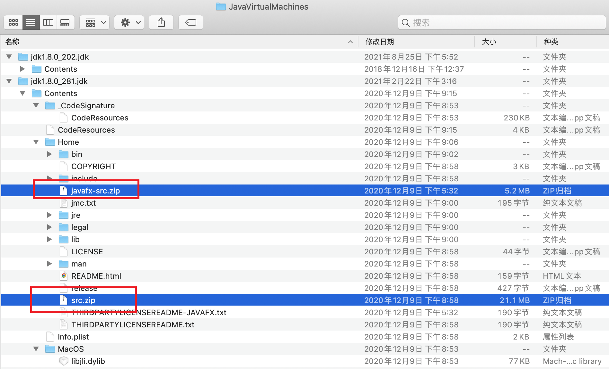
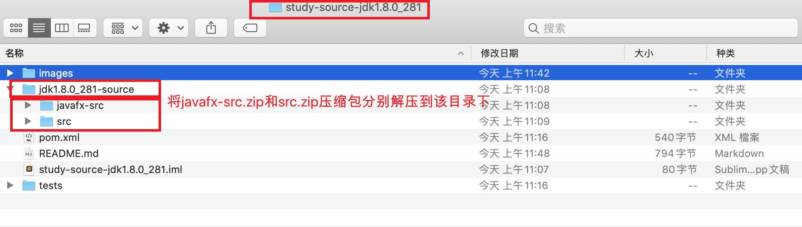
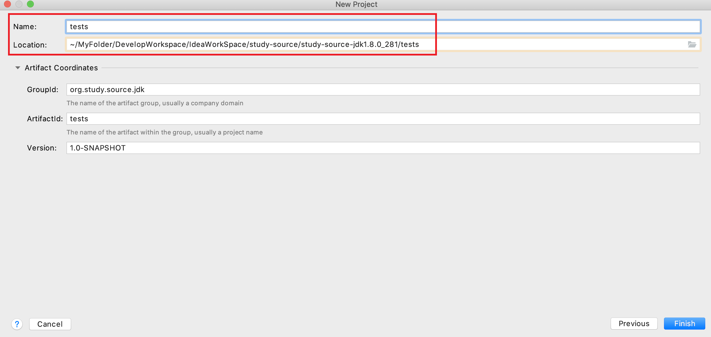
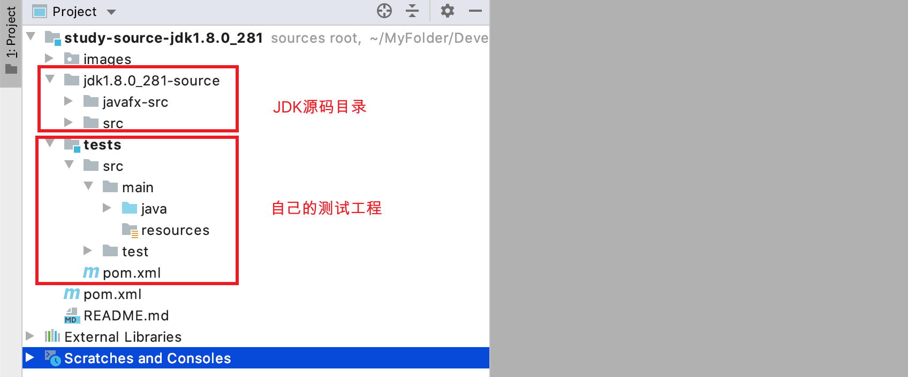
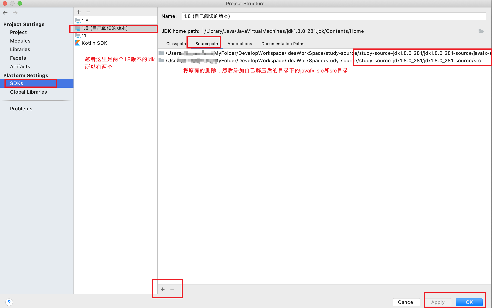
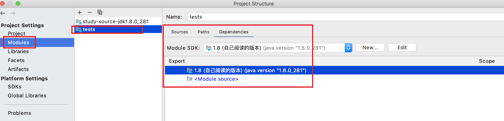
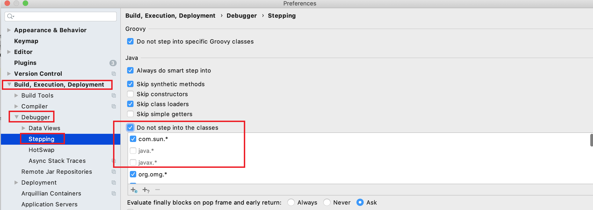
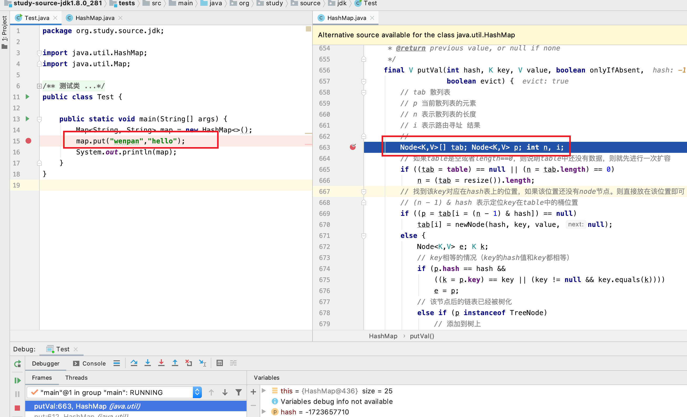

## 一、工程说明

- 该工程是用于本地调试JDK相关源码，以及为源码添加注释
- 该工程下`study-source-jdk1.8.0_281`目录为从`jdk1.8.0_281`中拷贝出的源码包解压后的源码，`tests`目录为笔者调试JDK源码而建立的本地调试module。整个工程结构还是非常简单的
- 可以直接运行`org.study.source.jdk.Test`示例开始源码调试


## 二、搭建JDK本地调试环境步骤

> 可以直接拉取该工程本地稍作调整即可运行，如果想要自己本地一步步的搭建，那么可以follow如下步骤，在10分钟内即可完成本地环境搭建

### 1、找到src.zip和javafx-src.zip

- 找到你想要调试的JDK，笔者本地电脑上装了两个版本的JDK，这里以jdk1.8.0_281为例
- 将JDK目录下的`javafx-src.zip和src.zip`两个压缩包进行拷贝（这里就是源码）




### 2、新建目录并解压压缩包

- 新建一个目录，由于笔者这里是基于`jdk1.8.0_281`的JDK拷贝出来的zip，所以笔者建了一个名为`study-source-jdk1.8.0_281`的文件夹，表示用于学习`jdk1.8.0_281`源码，并且在该目录下新建了一个名称为 `jdk1.8.0_281-source` 的目录用于存放`javafx-src.zip和src.zip`解压后的源码
- 将上一步拷贝出来的两个zip压缩包解压到 `jdk1.8.0_281-source`目录下




### 3、新建测试项目

- 笔者这里为了方便管理和以后查看，所以将测试项目建在了和源码目录（`jdk1.8.0_281-source`）同级的目录下
  - `jdk1.8.0_281-source` 下存放的是解压后的JDK源码
  - 同级目录下的`tests`是笔者建立的测试项目



- 测试项目建好后的目录整体结构如下




### 4、替换测试工程的sourcePath

- 找到project settings
- 然后找到SDKs，然后找到jdk，然后找到sourcePath进行替换




### 5、选择测试项目依赖的jdk

- 可以看到该JDK就是我们刚刚替换sourcePath的JDK




### 6、idea debug设置调整

- 找到`Execution,Deployment ,Deployment `
- 然后找到`Debugger`
- 然后找到`Stepping`
- 把`Do not step into the classes`中的`java.*`和`javax.*`的勾去掉




### 7、测试验证

- 经过上面的一系列步骤，我们的测试项目就搭建好了，这里新建一个类来测试一下，看看是否能跳转到我们修改后的源码里

#### ①、在测试工程里编写一个测试类

```java
package org.study.source.jdk;

import java.util.HashMap;
import java.util.Map;

/**
 * 测试类
 */
public class Test {

    public static void main(String[] args) {
        Map<String, String> map = new HashMap<>();
        map.put("wenpan","hello");
        System.out.println(map);
    }
}
```

#### ②、debug源码

- 可以看到成功进入源码里了，我们可以对该源码添加自定义注释或修改




